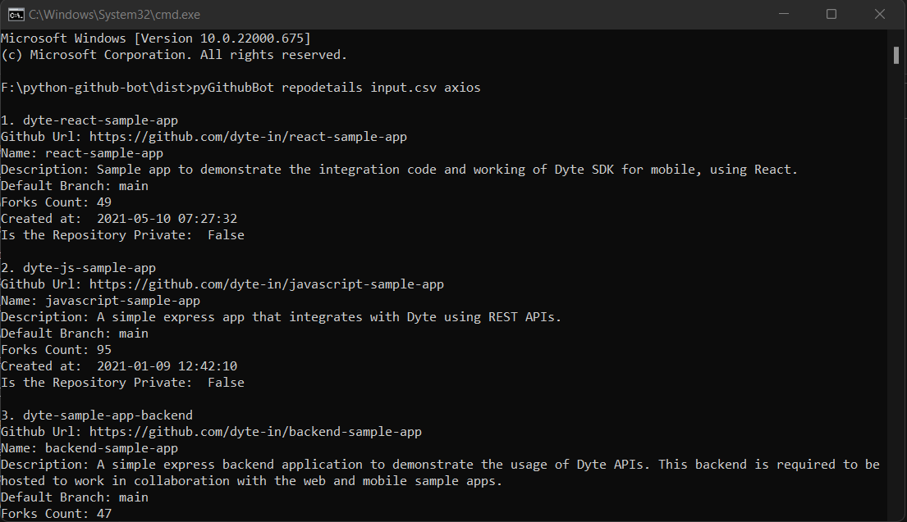
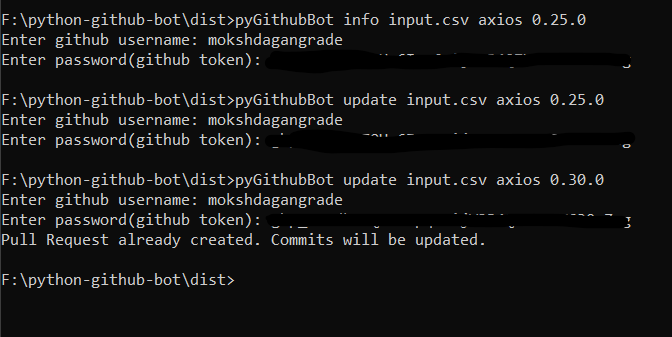
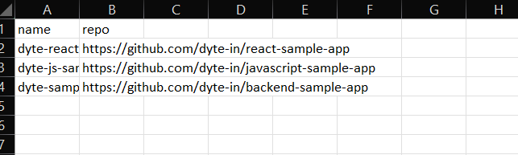
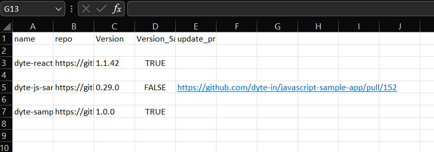
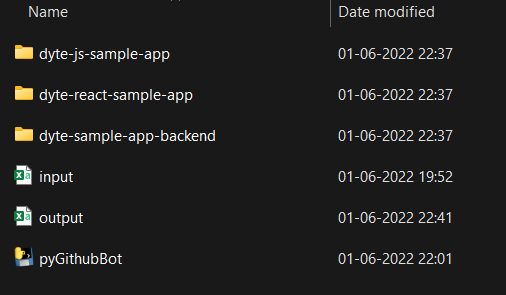

[](https://classroom.github.com/online_ide?assignment_repo_id=7950012&assignment_repo_type=AssignmentRepo)
<div id="top"></div>
<!--
*** Thanks for checking out the Best-README-Template. If you have a suggestion
*** that would make this better, please fork the repo and create a pull request
*** or simply open an issue with the tag "enhancement".
*** Don't forget to give the project a star!
*** Thanks again! Now go create something AMAZING! :D
-->


<!-- PROJECT SHIELDS -->
<!--
*** I'm using markdown "reference style" links for readability.
*** Reference links are enclosed in brackets [ ] instead of parentheses ( ).
*** See the bottom of this document for the declaration of the reference variables
*** for contributors-url, forks-url, etc. This is an optional, concise syntax you may use.
*** https://www.markdownguide.org/basic-syntax/#reference-style-links
-->
[![Contributors][contributors-shield]][contributors-url]
[![Forks][forks-shield]][forks-url]
[![Stargazers][stars-shield]][stars-url]
[![Issues][issues-shield]][issues-url]
[![MIT License][license-shield]][license-url]
[![LinkedIn][linkedin-shield]][linkedin-url]


<!-- PROJECT LOGO -->
<br />
<div align="center">
  <a href="https://github.com/dyte-submissions/dyte-vit-2022-mokshdagangrade/">
    
  </a>

<h3 align="center">pyGithubBot</h3>

  <p align="center">
    This is a python tool that automates the process of reviewing repositories from a file and sending pull requests after committing the changes.
    <br />
    
  </p>
</div>


<!-- TABLE OF CONTENTS -->
<details>
  <summary>Table of Contents</summary>
  <ol>
    <li>
      <a href="#about-the-project">About The Project</a>
      <ul>
        <li><a href="#built-with">Built With</a></li>
      </ul>
    </li>
    <li>
      <a href="#getting-started">Getting Started</a>
      <ul>
        <li><a href="#prerequisites">Prerequisites</a></li>
        <li><a href="#installation">Installation</a></li>
      </ul>
    </li>
    <li><a href="#usage">Usage</a></li>
    <li><a href="#contributing">Contributing</a></li>
    <li><a href="#license">License</a></li>
    <li><a href="#contact">Contact</a></li>
    <li><a href="#acknowledgments">Acknowledgments</a></li>
  </ol>
</details>


<!-- ABOUT THE PROJECT -->
## About The Project

This is a Python Command Line Tool that helps to query Github Repositories and find out their versions, as well as update the versions and send a Pull Request to the main branch. This tool can automate the process and in future can be customised to a more personalised tool for specific requests.

<p align="right">(<a href="#top">back to top</a>)</p>


### Built With

* [Python](https://www.python.org/)
* [pyGithub](https://github.com/PyGithub/PyGithub)
* [GitPython](https://github.com/gitpython-developers/GitPython)
* [Typer](https://typer.tiangolo.com/)
<p align="right">(<a href="#top">back to top</a>)</p>


<!-- GETTING STARTED -->
## Getting Started

To get a local copy up and running follow these simple example steps.

### Prerequisites

* Git
* Python
* Generate a github personal access token with scopes: repo, admin:org, gist

### Installation

1. Clone the repo
   ```sh
   git clone https://github.com/dyte-submissions/dyte-vit-2022-mokshdagangrade.git
   ```
2. Go to the dist folder and open cmd.

<p align="right">(<a href="#top">back to top</a>)</p>


<!-- USAGE EXAMPLES -->
## Usage

There are three commands to enter in the command prompt. A sample input.csv is there in this project.
1. Get Repository Details of repos in the csv file.
```sh
   pyGithubBot repodetails input.csv axios
   ```
   <div align="center">
    
  </div>
  <br><br>
2. Check if the versions of the repos in input file are above the given version.
Command: pyGithubBot info {input file} {os} {version}

```sh
   pyGithubBot info input.csv axios 0.35.0
   ```
3. This will update the versions, commit, push and generate a pull request. 
Command: pyGithubBot update {input file} {os} {version}

```sh
   pyGithubBot update input.csv axios 0.35.0
   ```
   <div align="center">
    
  </div>
  <br><br>
  
  <div align="center">
    
  </div>
  <br><br>
  <div align="center">
    
  </div>
  <br><br>
<div align="center">
    
  </div>
  <br><br>
<p align="right">(<a href="#top">back to top</a>)</p>


<!-- CONTRIBUTING -->
## Contributing

Contributions are what make the open source community such an amazing place to learn, inspire, and create. Any contributions you make are **greatly appreciated**.

If you have a suggestion that would make this better, please fork the repo and create a pull request. You can also simply open an issue with the tag "enhancement".
Don't forget to give the project a star! Thanks again!

1. Fork the Project
2. Create your Feature Branch (`git checkout -b feature/AmazingFeature`)
3. Commit your Changes (`git commit -m 'Add some AmazingFeature'`)
4. Push to the Branch (`git push origin feature/AmazingFeature`)
5. Open a Pull Request

<p align="right">(<a href="#top">back to top</a>)</p>


<!-- LICENSE -->
## License

Distributed under the MIT License. See `LICENSE.txt` for more information.

<p align="right">(<a href="#top">back to top</a>)</p>


<!-- CONTACT -->
## Contact

Your Name - Mokshda Gangrade - mokshdagangrade@gmail.com

Project Link: [[https://github.com/github_username/repo_name](https://github.com/dyte-submissions/dyte-vit-2022-mokshdagangrade/)]

<p align="right">(<a href="#top">back to top</a>)</p>


<!-- ACKNOWLEDGMENTS -->
## Acknowledgments

* Dyte.io Team for giving me this assignment. 

<p align="right">(<a href="#top">back to top</a>)</p>


<!-- MARKDOWN LINKS & IMAGES -->
<!-- https://www.markdownguide.org/basic-syntax/#reference-style-links -->
[contributors-shield]: https://img.shields.io/github/contributors/github_username/repo_name.svg?style=for-the-badge
[contributors-url]: https://github.com/github_username/repo_name/graphs/contributors
[forks-shield]: https://img.shields.io/github/forks/github_username/repo_name.svg?style=for-the-badge
[forks-url]: https://github.com/github_username/repo_name/network/members
[stars-shield]: https://img.shields.io/github/stars/github_username/repo_name.svg?style=for-the-badge
[stars-url]: https://github.com/github_username/repo_name/stargazers
[issues-shield]: https://img.shields.io/github/issues/github_username/repo_name.svg?style=for-the-badge
[issues-url]: https://github.com/github_username/repo_name/issues
[license-shield]: https://img.shields.io/github/license/github_username/repo_name.svg?style=for-the-badge
[license-url]: https://github.com/github_username/repo_name/blob/master/LICENSE.txt
[linkedin-shield]: https://img.shields.io/badge/-LinkedIn-black.svg?style=for-the-badge&logo=linkedin&colorB=555
[linkedin-url]: https://linkedin.com/in/linkedin_username
[product-screenshot]: images/screenshot.png
